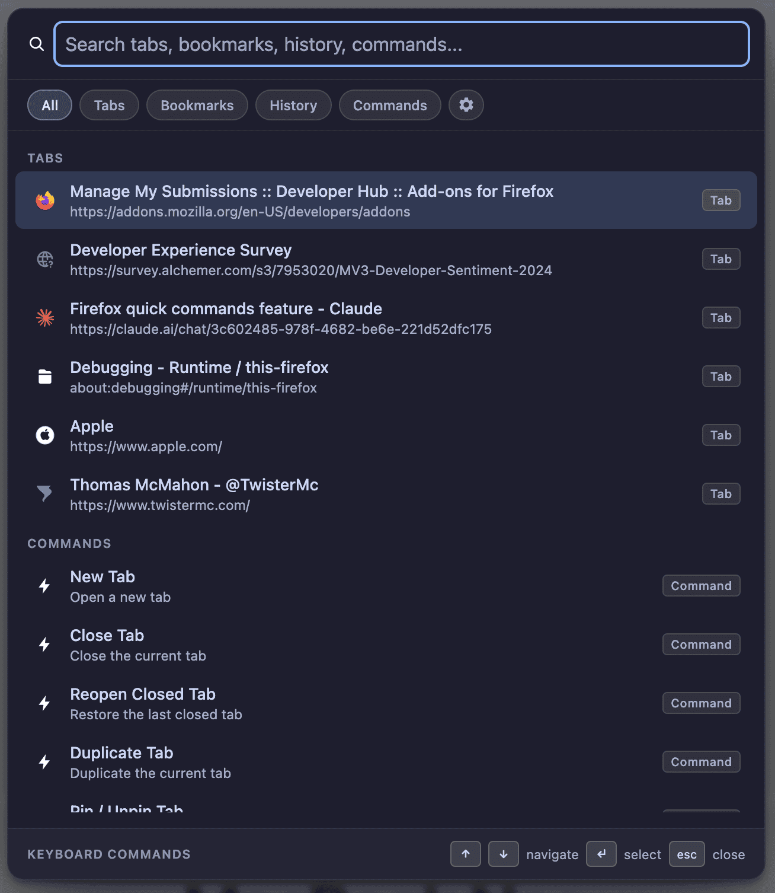

# Quick Commands for Firefox

A Vivaldi-inspired Quick Commands palette for Firefox. Press **Shift+Cmd+K** (Mac) or **Shift+Ctrl+K** (Windows/Linux) to open it from any page.

---

## Features

| Category        | What it does                                                       |
| --------------- | ------------------------------------------------------------------ |
| **Open Tabs**   | Search and switch to any open tab in the current window            |
| **Closed Tabs** | Reopen recently closed tabs                                        |
| **Bookmarks**   | Search and open any bookmark                                       |
| **History**     | Full-text search your browsing history                             |
| **Commands**    | Browser commands for tabs, navigation, zoom, settings, and windows |
| **Search**      | Search with your default search engine                             |

### Settings

Open extension preferences to choose which sources are searched:

- Tabs
- Recently Closed Tabs
- Bookmarks
- Commands
- History

### Keyboard Shortcut

The default shortcut is **Shift+Cmd+K** (Mac) or **Shift+Ctrl+K** (Windows/Linux). You can change it in the extension settings.

### Keyboard shortcuts in the palette

| Key           | Action                              |
| ------------- | ----------------------------------- |
| `↑` / `↓`     | Navigate results                    |
| `Enter`       | Select / activate                   |
| `Tab`         | Auto-complete URL into search field |
| `Esc`         | Close palette                       |
| Click outside | Close palette                       |

---

## Installation

Coming soon to Mozilla Add-ons!

## Notes About Favicons

Quick Commands uses Firefox-provided tab favicons when available, and falls back to the Vemetric favicon API for bookmarks, history, and any tab entries that do not already include an icon.

## Privacy

This add-on reads your browser data, but it does not collect any information.

## Donate

If you find FF Quick Commands useful and would like to support its development, consider [making a donation](https://ko-fi.com/twistermc).

Every bit helps and is greatly appreciated!
